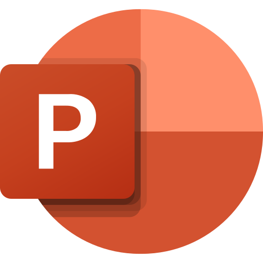

# Hi, I'm Mario Naldi 👋

I'm a **Bachelor of Business Administration student** at [Technical University of Cartagena (UPCT)](https://www.upct.es/), member of the [European University of Technology (EUt+)](https://www.univ-tech.eu/) alliance.

Curious by nature, I currently use GitHub mainly to write and manage my Bachelor's Thesis in LaTeX, while exploring new tools and ideas for future projects.

## Technologies & Tools

  

## Currently

* Writing my Bachelor's Thesis in LaTeX
* Learning how to use Git and GitHub
* Exploring ideas for future projects

## Let's Connect

